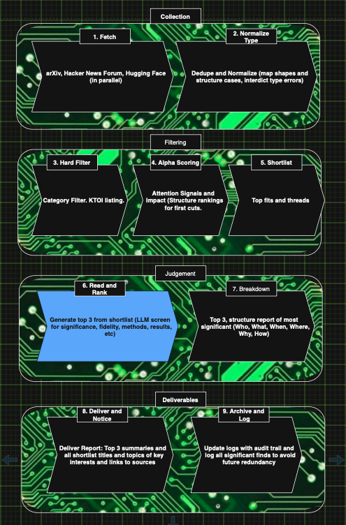

# ACIA pipeline — stage reference

Four phases, ten stages. Data flows one direction, top to bottom, phase to phase. Nothing in a later stage can trigger an earlier one to re-run — a failure halts the run and waits for you to look at the log.

---

## Phase 1: Collection

### Stage 1 — Source collectors
Three independent functions, one per source: arXiv, Hacker News, Papers with Code. Each hits its own API, asks for recent items (new submissions for arXiv, front-page/AI-tagged stories for HN, trending repos for PwC), and returns whatever shape that API natively gives back — arXiv's own field names, HN's own field names, PwC's own field names. None of the three know the others exist, and none of them reshape or filter anything yet. If one source's API is down, the other two keep working.

### Stage 2 — Normalizer
Takes the three different raw shapes from stage 1 and forces them into one common shape — the `PaperRecord` — with fields like id, title, abstract, url, source, timestamp, and raw signal data. Also dedupes: if the same paper showed up via arXiv and got mentioned on HN, this merges it into one record instead of two. Everything after this stage only ever sees the one standardized shape, regardless of where a paper actually came from.

---

## Phase 2: Filtering

### Stage 3 — Hard filter
Pure code, no LLM call. Checks each paper's category against a topic list — key topics of interest (KTOI) — read from an editable config file (e.g. `topics.json`), not hardcoded into the pipeline. Starting set: defense, autonomy, robotics, and whatever else gets added over time; arXiv category tags (cs.LG, cs.AI, cs.RO, cs.CV, cs.MA) map into these topics rather than being the filter itself. Anything outside the topic list gets dropped. Editing this file — adding a topic, retiring one — never requires touching pipeline code. Cuts the daily pool from several hundred candidates down to a couple hundred at most.

### Stage 4 — Signal scorer
Still no LLM call. Attaches the "attention" numbers gathered in stage 1 — HN upvotes, PwC stars/forks, any other raw popularity signal — to each surviving paper. This step doesn't judge quality, only visibility: it answers "how much is this being noticed today," not "is this good."

### Stage 5 — Shortlist
Sorts the scored pool by that attention number and keeps only the top N (roughly 10–15). Everything else is dropped from consideration for the day. This is the last cheap, free step — everything past this point costs real API money, so its whole job is to hand the next stage the smallest, most relevant pile possible.

---

## Phase 3: Judgment

### Stage 6 — Deep-read ranker
The expensive, judgment-heavy stage. For each shortlisted paper, pulls more than just the abstract (intro + results, ideally) and scores it against a rubric — novelty, rigor, robustness, significance — plus a relevance boost. The relevance boost reads from its own config, separate from stage 3's KTOI file: where KTOI is the broad topic list used as a hard filter, this list is the specific subprocesses/elements *within* a topic (e.g. under robotics: manipulation, SLAM, sim-to-real transfer) used only as a soft weight. Whether this ends up as a standalone file or nested under each KTOI entry is still open. Every candidate gets a score and a written justification, not just the winner, so the day's decision is fully auditable after the fact.

### Stage 7 — Fallback check
A cheap conditional check, no LLM call. If the top score from stage 6 doesn't clear a minimum bar, this stage swaps in a foundational or classic paper instead of a weak "best of a bad day" pick. Keeps the daily habit consistent even on days when nothing new is actually worth reading.

---

## Phase 4: Output

### Stage 8 — Breakdown writer
One LLM call, on the single winning paper only (never the whole shortlist, to keep cost down). Writes the actual daily breakdown — problem, method, result, why it matters, a caveat — in Ciai's voice.

### Stage 9 — Delivery
No LLM call. Sends the finished breakdown out by email. Kept as its own stage, separate from the writing logic, so the delivery channel can change later without touching how the breakdown gets written.

### Stage 10 — Archive & log
No LLM call. Records everything about the run: the full candidate pool, every score and rationale from stage 6, the final pick, delivery status, timestamp, model version used, and actual spend. This is what makes the whole pipeline traceable after the fact, and it's the data you'd look at to check for real quality drift over time — not the tone of a given day's greeting, but whether the scores and picks are holding up.

---

## Cost and reliability notes, by stage

- Stages 1–5, 7, 9, 10: free or near-free — no LLM involved.
- Stage 6: the main cost driver. Budget-gated live, mid-run — if cumulative spend approaches the $1 cap, the pipeline stops scoring further candidates and ranks on what it already has, rather than overshooting.
- Stage 8: small, fixed cost regardless of shortlist size, since it only ever processes the winner.
- No stage retries itself automatically on failure. A failure logs, halts, and waits for manual re-authorization to run again.
